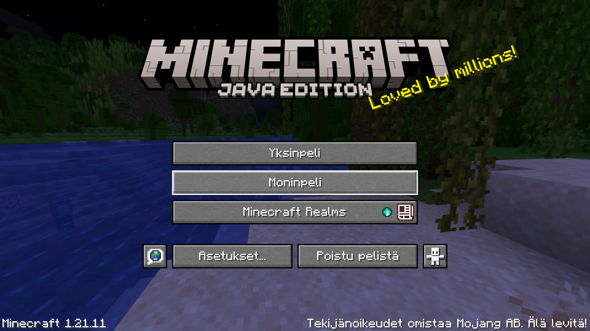
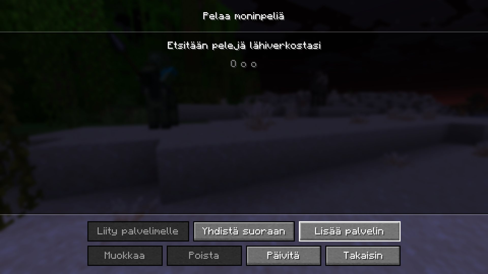
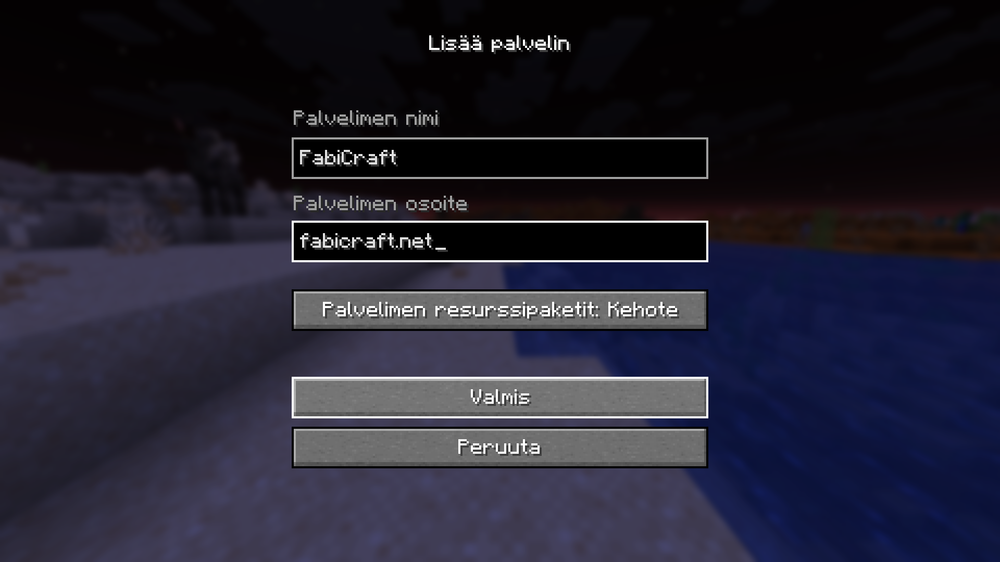
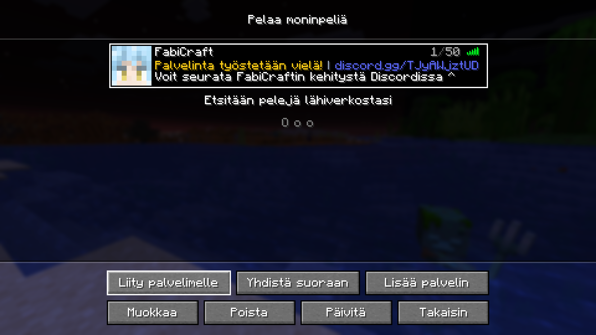

Pelataksesi FabiCraftissa tarvitset Minecraftin Java-version. Tämä tarkoittaa siis käytännössä sitä, että puhelimella/konsolilla ei siis pääse palvelimelle.

Palvelimelle liittyminen vaatii Discord-linkityksen.

## Lisää itsesi Discordissa

Liity [Fabicraftin Discordiin](https://discord.gg/TJyAWjztUD) ja lue läpi `info-ja-säännöt` -kanava.

Kirjoita `/link <minecraftKäyttäjänimi>` mille tahansa tekstikanavalle.

Näin linkitys on valmis ja voit liittyä palvelimelle!

## Palvelimen lisääminen Minecraftissa

Valitse alkuvalikosta `Moninpeli`.

Lisää uusi palvelin painamalla `Lisää palvelin` -nappulaa ruudun alaosasta.

Aseta palvelimen nimeksi FabiCraft ja osoitteeksi `fabicraft.net`. Sen jälkeen paina `Valmis`.

Valitse palvelinlistasta FabiCraft ja paina `Liity palvelimelle`.

Ja näin pitäisi sinun olla pelaamassa! Muistathan lukea [Palvelimen säännöt](/rules) ennen pelailun aloittamista. Mukavia pelihetkiä!
